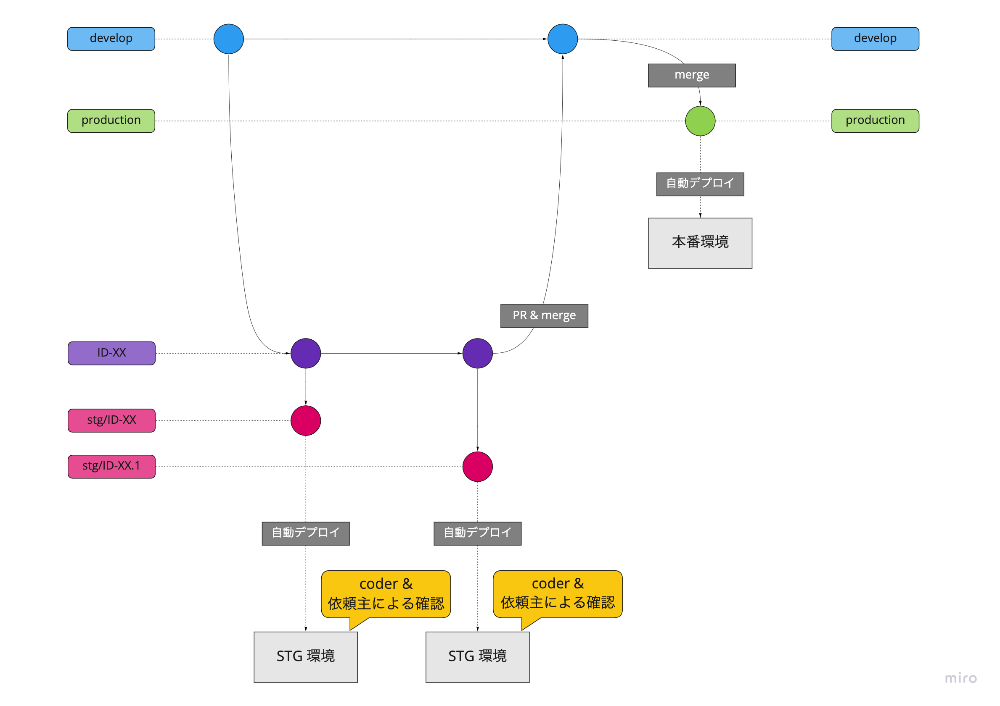

# 備忘録

## 現在の運用

**開発フロー**
1. coder さんが develop ブランチからチケット ID 名で開発ブランチを作成し開発
    - ブランチ名の例: `ID-32`
2. coder さんは開発ブランチを push
3. 開発ブランチから STG 環境への deploy 用ブランチを作成し push
    - **!!重要!!** ブランチ名は `stg/xxxx` の形式にする
    - 例: `stg/ID-32`、`stg/ID-32.1`
4. （push トリガーで STG 環境へ自動 deploy）
5. coder さん + 依頼者が STG 環境でレビュー
6. coder さんが develop へ PR をだす
7. coder さんが自ら develop へマージ & push
    - 必要なら TECH がマージを調整する
8. develop を production へマージ & push
9. （push トリガーで 本番環境へ自動 deploy）



**Memo**
- STG 環境への deploy 用ブランチは使い捨て運用する
    - stg/xxxx
- develop ブランチ
    - デフォルトブランチ
- production ブランチ
    - 本番環境ブランチ
- testing ブランチ
    - TECH 専用
    - ここへ push すると STG 環境へデプロイされる
- staging ブランチ
    - 不要のため廃止


## ホスティング
- リソースは S3 におかれ、そのまま S3 + CloudFront でホスティングされている
- [STG 環境](https://d1bakie3lj2p2g.cloudfront.net/)
    - ユーザー名: `user`
    - パスワード: `pass`
- [本番環境](https://airdesign.ai/)


## deploy

GitHub アクションで deploy & CloudFront キャッシュクリアできる。

deploy 時にやっていることは以下の通り
1. 当該ブランチの内容をそのまま S3 へ sync（ミラーリング）
2. CloudFront のキャッシュをクリア


手動で行う場合は以下のコマンド（aws cli入れといてください。profileは設定しておきましょう）

**staging**
```
aws s3 sync . "s3://airdesign-website-staging" \
    --delete --acl public-read \
    --exclude "*.git*" --exclude "*.github*" \
    --exclude "README.md" --exclude "README_files*" \
    --profile air-design-lp-staging
aws cloudfront create-invalidation \
    --distribution-id "E5R3CGQ6JDVRL" --paths "/*" \
    --profile air-design-lp-staging
```

**production**
```
aws s3 sync . "s3://air-design-website-production" \
    --delete --acl public-read \
    --exclude "*.git*" --exclude "*.github*" \
    --exclude "README.md" --exclude "README_files*" \
    --profile air-design-lp-production
aws cloudfront create-invalidation \
    --distribution-id "E1NPRRAABLQ3PO" --paths "/*" \
    --profile air-design-lp-production
```
